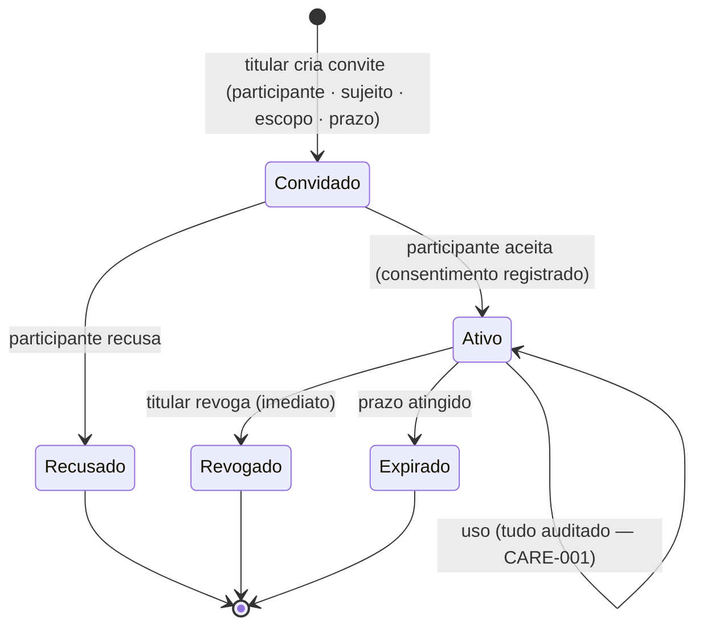

# CARE-002 — Rede de Cuidado: participantes, permissões e alertas

> **Estende** [CARE-001](CARE-001_ESPACO_COLABORATIVO.md) — **não** o duplica. Herda todos os seus princípios
> inegociáveis (paciente é dono do acesso · por finalidade · somente leitura · documento é a fonte da verdade ·
> auditoria append-only · **a plataforma NÃO interpreta** — RDC 657 · Snapshot imutável). Aqui detalhamos **quem**
> participa, **o que cada um pode**, o elo **multi-sujeito** ([JOR-001](JOR-001_JORNADA_DE_SAUDE.md)) e os **alertas**
> à rede (via [NOTIF-001](NOTIF-001_NOTIFICACOES.md)). Modelagem de produto — sem UI/código.

## 1. Participantes — modelo ABERTO em duas famílias

A Rede de Cuidado tem participantes de **duas naturezas**. O modelo é **aberto** (novo tipo degrada, não quebra —
princípio do Modelo Aberto): um papel desconhecido entra como "Outro profissional"/"Outro da rede pessoal" sem
travar o sistema.

**A. Profissionais de saúde** (entram por um Care Space, por finalidade — CARE-001):
médico · pediatra · psicólogo · nutricionista · fisioterapeuta · educador físico · dentista · odontopediatra ·
enfermeiro · fonoaudiólogo · terapeuta ocupacional · … (aberto). Identificação: nome · registro do conselho
(CRM/CRP/CRN/CREFITO…) · especialidade · instituição · contato.

**B. Rede pessoal** (não-profissionais, vínculo de confiança/tutela):
familiar · cuidador(a) · responsável legal/tutor. Sem registro de conselho; vínculo declarado (relação) +
consentimento. É a família que o JOR-001 (multi-sujeito) torna necessária.

## 2. Sujeito do cuidado — a quem o acesso se refere (elo com JOR-001)

Todo vínculo da Rede de Cuidado é concedido **sobre um SUJEITO**: a **titular** ou um **dependente** (JOR-001).
Exemplos: **pediatra** → acesso à **Saúde Infantil de um filho**; **obstetra** → à **Gestação** da titular;
**cuidador** → à rotina de medicação de um **dependente idoso** (futuro). A titular (ou tutor) é quem **concede
e revoga** — inclusive o acesso à saúde dos dependentes sob sua tutela (LGPD: dado sensível de terceiro sob
responsabilidade da titular).

## 3. Capacidades (o que se pode fazer) — herdadas + estendidas de CARE-001

`visualizar` · `baixar` · `imprimir` · `comentar` · `solicitar atualização` · **`receber alertas`** (nova, §5).
**Nunca** existe `editar` — o profissional/rede **jamais** altera a base do sujeito (invariante CARE-001).

## 4. Matriz de permissões (PERFIS PADRÃO — sempre sobrescritíveis pela titular)

Perfis são **defaults** por papel; a titular ajusta caso a caso (concede menos ou mais), por **módulo/fase** e
por **prazo** (compartilhamento temporário, CARE-001). "—" = não por padrão.

| Papel | visualizar | comentar | solicitar atualização | receber alertas | escopo típico |
|---|---|---|---|---|---|
| Médico / especialista | ✅ (escopo da finalidade) | ✅ | ✅ | opcional | o Care Space da consulta |
| Pediatra | ✅ | ✅ | ✅ | opcional | Saúde Infantil do dependente |
| Psicólogo / Nutri / Fisio / Ed. físico / Dentista | ✅ (escopo do seu domínio) | ✅ | — (por padrão) | opcional | recorte do seu domínio/fase |
| Familiar autorizado | ✅ (escopo definido) | — | — | ✅ (se autorizado) | acompanhamento |
| Cuidador(a) | ✅ (operacional: agenda/medicação) | — | — | ✅ | rotina/lembretes do sujeito |
| Responsável legal / Tutor | ✅ (amplo sobre o dependente) | ✅ | ✅ | ✅ | dependente sob tutela |

> Princípio: **menor privilégio por padrão**; a titular amplia conscientemente. Todo acesso e toda mudança de
> permissão entram na **auditoria append-only** do CARE-001 (quem · quando · o quê · concessão/revogação).

## 5. Alertas à rede (integração com NOTIF-001)

Hoje o [NOTIF-001](NOTIF-001_NOTIFICACOES.md) notifica **a titular**. A Rede de Cuidado adiciona um **destinatário**:
um participante **autorizado** pode receber **alertas específicos** — sempre governado pela Central (autoridade
única de preferências) e pela permissão `receber alertas`.

- Exemplos: cuidador recebe o **lembrete de medicação** do dependente; familiar recebe aviso de **consulta
  agendada**; tutor recebe o **calendário vacinal** da criança.
- **Fronteira factual (RDC 657):** o alerta é sempre um **evento/lembrete factual** (agendamento, dose, retorno),
  **nunca** interpretação clínica ("piorou", "risco elevado"). Reusa `event_key` + canal (e-mail/WhatsApp) do NOTIF-001.
- **Governança:** o participante só recebe o que a titular autorizou; revogar o acesso **corta os alertas** junto.

## 6. Consentimento, revogação e auditoria (reuso CARE-001 + nota multi-sujeito)

- **Consentimento** explícito por participante × sujeito × escopo × prazo. Para **dependente**, o consentimento é
  exercido pela **titular/tutor**.
- **Revogação imediata** (CARE-001): encerra visualização, comentários e **alertas**; o **Snapshot** já
  compartilhado permanece imutável (registro histórico da consulta), mas sem novos acessos.
- **Auditoria append-only** (CARE-001) cobre todos os papéis desta extensão, incluindo alertas enviados.

## 7. O que NÃO muda (invariantes reafirmadas)

- Somente leitura; **jamais** editar a base do sujeito. Comentário/plano = conteúdo **do participante**.
- Plataforma **não interpreta** (RDC 657): nenhum resumo/juízo clínico gerado pela SINTERA.
- Documento original = fonte da verdade; Snapshot imutável; menor privilégio; auditoria total.
- Nenhum pipeline novo — orquestração sobre CARE-001 + JOR-001 + NOTIF-001 + Evento Assistencial.

## 8. Ciclo de vínculo (convite → aceite → revogação)

Estados de um vínculo participante × sujeito, reusando CARE-001 (paciente é dono; revogação imediata; snapshot imutável):

- **Convite** — a titular define **quem** (participante), **sobre quem** (sujeito: titular ou dependente — MUL-001),
  **o quê** (escopo por módulo/fase), **por quanto tempo** (prazo). Nada é acessível antes do aceite.
- **Aceite** — o participante aceita; o **consentimento** fica registrado (para dependente, exercido pela
  titular/tutor). Só então há acesso, sempre de **menor privilégio** (§4).
- **Uso** — todo acesso, comentário e alerta entram na **auditoria append-only** (CARE-001).
- **Revogação** (imediata, a qualquer tempo) ou **expiração** (prazo) — encerram visualização, comentários e
  **alertas**; o **Snapshot** já compartilhado permanece imutável (registro histórico da consulta).
- **Compartilhamento por sujeito** — cada vínculo é **sobre um sujeito**; um pediatra ativo na Saúde Infantil de
  um filho **não** vê os dados da titular nem de outro dependente.

## 9. Decisões a ratificar (fundadora)

- **D-RC-1** — Perfis padrão da §4 (menor privilégio) ok como ponto de partida?
- **D-RC-2** — "Rede pessoal" (familiar/cuidador/tutor) entra já no modelo, junto com os profissionais?
- **D-RC-3** — Alertas à rede (§5) só via NOTIF-001 (autoridade única), com a permissão `receber alertas`?
- **D-RC-4** — Consentimento de dependente exercido pela titular/tutor (LGPD) — confirmado?

---
**Conformidade:** ✔ REG-001 · ✔ LGPD · ✔ ADR-001 · ✔ RDC 657

*Relaciona: CARE-001 (base) · JOR-001 (multi-sujeito/dependente) · NOTIF-001 (alertas) · Evento Assistencial ·
Modelo Aberto · RDC 657 · LGPD.*
