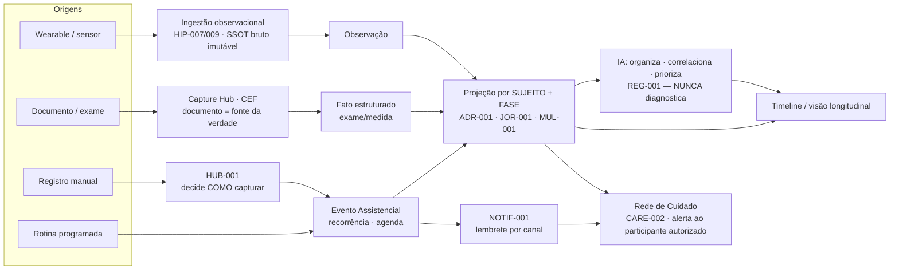

# MAP-001 — Mapa de eventos (fluxo único da arquitetura)

> Prioridade 7 da visão expandida. Um **mapa único** de como um fato percorre a plataforma — hoje descrito em
> vários docs. **Não** cria pipeline; **consolida** o existente (Capture · Evento Assistencial · Observação ·
> Hub · Projeção · IA · NOTIF · Rede · Timeline), já com os eixos novos (sujeito · fase). Guardrail [REG-001](REG-001_GUARDRAIL_REGULATORIO.md).

## 1. Fluxo canônico

## 2. Leitura do mapa (verbos seguros — REG-001)

1. **Origem** — wearable, documento, registro manual ou rotina. Cada uma preserva **proveniência**.
2. **Ingestão/Captura** — Observação (HIP-007/009, bruto imutável) ou fato estruturado (Capture/CEF, original é a
   fonte). O **HUB-001** decide *como* capturar; nunca interpreta.
3. **Evento Assistencial** — o que tem tempo/recorrência (consulta, dose, rotina) vira Evento (agenda + lembrete).
4. **Projeção** — tudo é organizado **por sujeito (MUL-001) e por fase (JOR-001)** — sem duplicar (ADR-001).
5. **IA** — sobre a projeção, **organiza, correlaciona e prioriza** o que merece atenção; **não** diagnostica nem
   recomenda conduta. Alimenta a Timeline (visualização estrutural).
6. **Notificação** — Eventos geram **lembretes factuais** (NOTIF-001, autoridade única de canal).
7. **Rede de Cuidado** — projeções e alertas chegam a participantes **autorizados** (CARE-002: consentimento,
   escopo por sujeito, auditoria). Ex.: cuidador recebe o lembrete da dose do dependente.
8. **Timeline** — a história longitudinal, sempre com o **documento original a um clique**.

## 3. Invariantes do fluxo

- **Um fato = um registro** (ADR-001); a projeção referencia, não copia.
- **SSOT bruto imutável** (HIP-009); correções geram nova versão, nunca sobrescrevem a origem.
- **Fronteira factual** (REG-001): em nenhum nó a plataforma produz diagnóstico/prognóstico/conduta.
- **Human-in-the-loop:** quem decide é a pessoa e/ou o profissional (CARE-001).
- **Sujeito e fase** atravessam todo o fluxo (MUL-001 · JOR-001) sem alterar os pipelines existentes.

---
*Relaciona: Capture Hub/CEF · HIP-007/009 (Observação) · HUB-001 · Evento Assistencial · ADR-001 (projeção) ·
JOR-001 (fase) · MUL-001 (sujeito) · IA (REG-001) · NOTIF-001 · CARE-002 · Timeline.*
