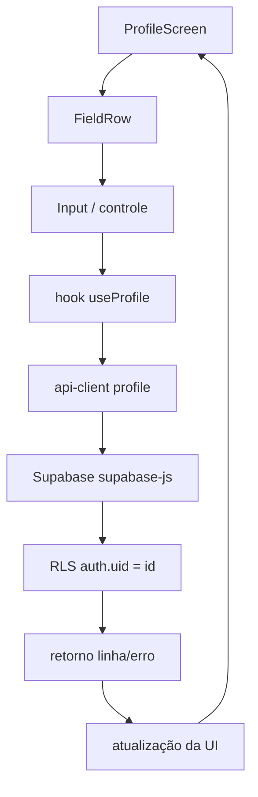

# MOBILE-019 — Especificação Operacional do Incremento 4 (Perfil) · "implementação em papel"

> **Objetivo (fundadora, 2026‑07‑27):** engenharia **preventiva**, sem implementar. Congelar fluxo, contratos,
> erros/recuperação, cenários de teste, segurança e a **sequência de commits**, de modo que **na quarta‑feira a
> primeira linha de código do Inc 4 seja escrita sem NENHUMA decisão arquitetural pendente.**
> Base: [MOBILE‑016](./MOBILE-016_PLANEJAMENTO_INCREMENTO4_PERFIL.md) (plano + decisões D1/D3) · [MOBILE‑018](./MOBILE-018_READINESS_REVIEW.md) (readiness). Sem emulador.
>
> **Escopo enxuto (pós D1/D3):** **editável = `name`, `phone`**; **exibição = `age_range`, `goals`, `avatar_url`**
> + sessão. Preferências de notificação: **fora** (futura Central no Mobile).

## 1. Auditoria do fluxo completo — pontos de falha e tratamento



| Ponto | Pode falhar? | Falha possível | Tratamento (congelado) |
|---|---|---|---|
| **ProfileScreen** | não | — | Máquina de estados (§4 estados); consome o hook, não conhece Supabase (fronteira Inc 1). |
| **FieldRow** | não | — | Presentational puro (DS‑003); sem lógica. |
| **Input/controle** | não | — | Controlado; preserva o texto do usuário mesmo em erro de rede. |
| **hook `useProfile`** | sim | `setState` após unmount · logout durante gravação · corrida de requisições | Aborta a requisição em voo no unmount/logout (`AbortController`); guarda de montagem; guarda de logout (ADR‑017). |
| **api-client `profile`** | sim | rede · timeout · erro de DB · abort | `getProfile` **lança**; `updateProfile` retorna `{error}` (§2/§3). Timeout interno via signal. |
| **Supabase** | sim | rede/5xx/timeout | Propagado como erro para o api-client. |
| **RLS** | sim | sessão expirada → sem permissão | Erro de auth → hook direciona ao gate de sessão (re‑login). Para a própria linha, `auth.uid()=id` sempre permite. |
| **retorno (map linha→DTO)** | sim | shape inesperado | O map projeta **só** os campos centrais (§ tipo); colunas de outros domínios nunca entram. Tipado. |
| **atualização da UI** | não | — | **Pessimista**: a UI só reflete "salvo" após confirmação do backend. |

## 2. Contrato `getProfile()` — CONGELADO

```ts
// @sintera/api-client — leitura do perfil do usuário autenticado.
getProfile(signal?: AbortSignal): Promise<ProfileDTO | null>
```
| Aspecto | Decisão |
|---|---|
| **Retorno** | `ProfileDTO` da linha do usuário; **`null` quando não há linha** (usuário novo) — vazio legítimo, **não** é erro. |
| **Erros** | **Lança/rejeita** em QUALQUER falha (rede, DB, timeout, abort). → o hook distingue **`null` = perfil vazio (defaults)** de **exceção = erro de carga (mensagem + retry)**. *(Refina a convenção "leitura→`T\|null`": `getSession` é leitura LOCAL que não falha; leitura de REDE precisa separar vazio de falha.)* |
| **Timeout** | Interno via `AbortController` + `DEFAULT_TIMEOUT_MS = 10000`; aborta a query (`.abortSignal`) → rejeita `TimeoutError`. `signal` externo (do hook) é **composto** com o interno. |
| **Retry** | **Nenhum automático** (pessimista; o usuário re‑dispara). |
| **Cancelamento** | `signal` opcional; o hook aborta no unmount/logout. |
| **Cache** | **Nenhum** no Inc 4 (a tela mantém o último valor em estado React; sem cache persistente; offline‑first = onda futura). |

## 3. Contrato `updateProfile()` — CONGELADO

```ts
// @sintera/api-client — grava os campos editáveis (upsert; a linha pode não existir).
type ProfileEditable = { name?: string | null; phone?: string | null } // SOMENTE estes (pós D1/D3)
updateProfile(patch: ProfileEditable, signal?: AbortSignal): Promise<{ error: Error | null }>
```
| Aspecto | Decisão |
|---|---|
| **Whitelist de colunas** | Payload montado de uma **lista fixa** `{ name, phone }` + `updated_at = now()`. **Nunca** repassa chaves arbitrárias → é AQUI que vive a proteção por coluna (RLS é por linha). Protegidas (não graváveis via Perfil): `age_range, goals, pref_*, avatar_url, id, cycle_*, height_cm, weight_goal_kg, last_seen_at`. |
| **Semântica** | **`upsert`** por `id` (= id da sessão) — cria a linha do usuário novo; atualiza a existente. |
| **Retorno** | `{ error: null }` sucesso; `{ error }` em falha/timeout/abort. (Convenção de escrita do pacote.) |
| **Conflito** | **Last‑write‑wins**; `updated_at` registrado, **não** usado como *optimistic concurrency* no Inc 4. |
| **Timeout / Retry / Cancelamento / Cache** | Iguais ao `getProfile` (§2): timeout 10 s via signal · sem retry automático · abortável · sem cache. |
| **Validação** | **NÃO** é do api-client — é da **tela** (§ cenário 3). O api-client só normaliza/repasse. |

## 4. Estados da tela — cobertura

`carregando` (leitura inicial) · `vazio` (`null` → defaults do DB; primeiro Salvar = upsert) · `carregado` ·
`salvando` (pessimista; botão em loading) · `salvo` (após confirmação do backend) · `erro de carga` (retry) ·
`erro de gravação` (mensagem clara, preserva input, permite novo Salvar) · `offline` (= erro de gravação, sem
fila) · `timeout` (= erro após 10 s). Transições dirigidas pelo `useProfile`; o `Button` reusa o estado loading (Inc 1).

## 5. Cenários de teste (além dos critérios de aceite)

| # | Cenário | Comportamento esperado |
|---|---|---|
| 1 | **Usuário novo** (sem linha) | `getProfile→null` → form com defaults; 1º Salvar → `upsert` cria a linha. |
| 2 | **Perfil inexistente × erro** | `null` = vazio (defaults); exceção = erro + retry. Distinção **garantida** pelo contrato §2. |
| 3 | **Telefone inválido** | **Validação na TELA** (formato livre normalizado, dígitos/`+`); FieldRow mostra `errorText` **antes** de chamar `updateProfile`. api-client não valida. |
| 4 | **Timeout** | Aborta em 10 s → estado de erro + novo Salvar; a tela não trava. |
| 5 | **Perda de conexão** | `updateProfile` falha → mensagem clara; **preserva o que o usuário digitou**; sem fila offline. |
| 6 | **Logout durante gravação** | O hook **aborta** a requisição em voo no unmount; gate troca para AuthStack (ADR‑017); resultado descartado. |
| 7 | **Dois dispositivos gravando** | **Last‑write‑wins**; sem *optimistic concurrency*; `updated_at` registrado. |

- **Estáticos (CI, sem emulador):** a tela não importa `supabase`/`createClient` (guarda `home-is-composition`); o tipo `ProfileDTO` não inclui campos de outros domínios.
- **Unitários (api-client):** `getProfile` (linha → DTO; ausência → `null`; erro → lança; timeout → rejeita) e `updateProfile` (whitelist; `upsert` sem linha; `{error}` em falha) com Supabase **mockado**.
- **Hook:** transições de estado (mock do api-client): carregando→carregado / vazio / erro; salvar→salvando→salvo/erro; abort no unmount.

## 6. Revisão de segurança — verificada no banco (2026‑07‑27)

| Item | Estado |
|---|---|
| **RLS SELECT** (`profiles_select`) | `auth.uid() = id` — lê **só** a própria linha. ✅ |
| **RLS INSERT** (`profiles_insert`) | `with_check auth.uid() = id` — cria **só** a própria linha (upsert de usuário novo). ✅ |
| **RLS UPDATE** (`profiles_update`) | `qual` + `with_check` `auth.uid() = id` — atualiza **só** a própria linha e **não** permite trocar o `id`. ✅ |
| DELETE | Sem política (Perfil não apaga). ✅ |
| **Colunas editáveis** | `name`, `phone` — **whitelist no api-client** (§3), pois RLS é por linha, não por coluna. |
| **Colunas protegidas** | `age_range, goals, pref_*, avatar_url, id, updated_at, cycle_*, height_cm, weight_goal_kg, last_seen_at` — nunca graváveis via Perfil. |
| **Fronteira (Inc 1)** | Zero acesso direto ao SDK Supabase em `apps/mobile`; tudo via api-client. |
| **Segredos** | anon key (pública) via config injetada; nunca Service Role no cliente. |

## 7. Roteiro de commits — "implementação em papel" (executar na quarta, pós‑homologação Inc 3)

> Base: `mobile-inc3-accepted`. Cada commit: **tsc + testes verdes + push** (disciplina Inc 2/3), isolado e reversível.

| # | Commit | Conteúdo | Verificação |
|---|---|---|---|
| 1 | **api-client: módulo `profile`** | `src/profile/{types.ts (ProfileDTO/ProfileEditable), get.ts, update.ts}` + util de timeout (`withTimeout`) + estender `ApiClient` de `{auth}` → `{auth, profile}` + fiar em `createApiClient`. | tsc + unitários (Supabase mockado). |
| 2 | **hook `useProfile`** | Busca no mount (com abort) + máquina de estados (§4) + salvar. Sem UI. | tsc + testes de transição (api-client mockado). |
| 3 | **tela `ProfileScreen`** | `FieldRow`+`Input` (name/phone editáveis) + exibição (age_range/goals/avatar) + `Button` salvar; consome o hook. | tsc + estáticos (sem supabase; sem campos de outro domínio). |
| 4 | **navegação** | Ponto de entrada no stack da aba "Mais" (§5 MOBILE‑016). | tsc + testes de navegação. |
| 5 | **validação + homologação** | CI verde + roteiro de homologação autenticada (editar → salvar → reabrir → persistido; sem regressão auth/nav/Home). | CI + homologação com a fundadora. |

## 8. Decisões congeladas (nada pendente para a quarta)

1. **`ApiClient`: `{auth}` → `{auth, profile}`** (`profile = { getProfile, updateProfile }`); módulo `profile` espelha a estrutura de `auth`.
2. **`getProfile`: `null` = vazio, exceção = falha** (refina a convenção de leitura para rede). ← *único ponto que refina a convenção do pacote; ver §2.*
3. **`updateProfile`: whitelist `{name, phone}` + `upsert` + `{error}`**; proteção por coluna no api-client.
4. **Timeout = 10 s via `AbortController`**; **sem retry automático**; **abortável**; **sem cache**; **last‑write‑wins**; **sem fila offline**.
5. **Validação é da tela**, não do api-client.
6. **Escopo:** editável `name`+`phone`; demais exibição; notificações fora (D1/D3).

**Resultado:** na quarta, a implementação segue o §7 direto — sem abrir nenhuma decisão arquitetural.

---
*Referências: MOBILE‑016 (plano/decisões) · MOBILE‑018 (readiness) · DS‑003 (primitivos) · ADR‑001/011/017 · NOTIF‑001 (por que notificação fica fora).*
